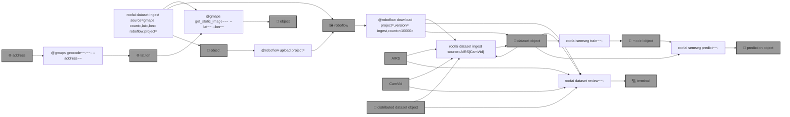

# 🏛️ roofai

everything AI about roofs. 🏛️

```bash
pip install roofai
```


```mermaid
graph LR
    dataset_ingest["roofai dataset ingest source=AIRS|CamVid|<distributed-dataset> <dataset-object-name>"]

    dataset_review["roofai dataset review~~- <dataset-object-name>"]

    semseg_train["roofai semseg train~~- <dataset-object-name> <model-object-name>"]

    semseg_predict["roofai semseg predict~~- <model-object-name> <dataset-object-name> <prediction-object-name>"]

    gmaps_get_static_image["@gmaps get_static_image~~- <object-name> --lat~~<lat> --lon~~<lon>"]

    gmaps_geocode["@gmaps geocode~~-~~- --address~~<address>"]

    dataset_ingest_gmaps["roofai dataset ingest source=gmaps <object-name> count=<count>,lat=<lat>,lon=<lon> roboflow,project=<project-name>"]

    roboflow_upload["@roboflow upload project=<project-name> <object-name>"]

    roboflow_download["@roboflow download project=<project-name>,version=<version> <object-name> ingest,count=<10000> <dataset-object-name>"]

    address["🌐 address"]:::folder
    lat_lon["🌐 lat,lon"]:::folder
    AIRS["AIRS"]:::folder
    CamVid["CamVid"]:::folder
    dataset_object_name["📂 dataset object"]:::folder
    distributed_dataset_object_name["📂 distributed dataset object"]:::folder
    model_object_name["📂 model object"]:::folder
    prediction_object_name["📂 prediction object"]:::folder
    object_name["📂 object"]:::folder
    object_name_static_image["📂 object"]:::folder
    terminal["💻 terminal"]:::folder
    roboflow["🖼️ roboflow"]:::folder

    dataset_object_name --> dataset_ingest
    distributed_dataset_object_name --> dataset_ingest
    AIRS --> dataset_ingest
    CamVid --> dataset_ingest
    dataset_ingest --> dataset_object_name

    dataset_ingest_gmaps --> gmaps_get_static_image
    dataset_ingest_gmaps --> roboflow
    dataset_ingest_gmaps --> object_name

    object_name --> roboflow_upload
    roboflow_upload --> roboflow

    roboflow --> roboflow_download
    roboflow_download --> dataset_ingest
    roboflow_download --> dataset_review
    roboflow_download --> dataset_object_name

    AIRS --> dataset_review
    distributed_dataset_object_name --> dataset_review
    CamVid --> dataset_review
    dataset_object_name --> dataset_review
    dataset_review --> terminal

    dataset_object_name --> semseg_train
    semseg_train --> model_object_name

    model_object_name --> semseg_predict
    dataset_object_name --> semseg_predict
    semseg_predict --> prediction_object_name

    lat_lon --> gmaps_get_static_image
    gmaps_get_static_image --> object_name_static_image

    address --> gmaps_geocode
    gmaps_geocode --> lat_lon

    classDef folder fill:#999,stroke:#333,stroke-width:2px;
```

--table--

---

--signature--