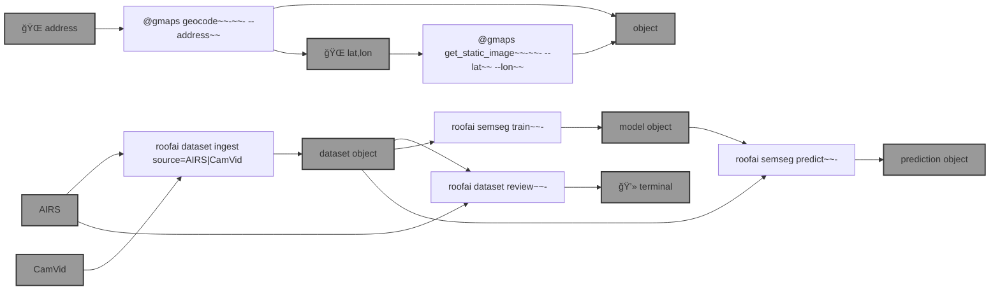

# ğŸ›ï¸ roofai

everything AI about roofs. ğŸ›ï¸

```bash
pip install roofai
```


```mermaid
graph LR
    dataset_ingest["roofai dataset ingest source=AIRS|CamVid <dataset-object-name>"]

    dataset_review["roofai dataset review~~- <dataset-object-name>"]

    gmaps_get_static_image["@gmaps get_static_image~~-~~- --lat~~<lat> --lon~~<lon>"]

    gmaps_geocode["@gmaps geocode~~-~~- --address~~<address>"]

    semseg_train["roofai semseg train~~- <dataset-object-name> <model-object-name>"]

    semseg_predict["roofai semseg predict~~- <model-object-name> <dataset-object-name> <prediction-object-name>"]

    address["🌠address"]:::folder
    lat_lon["🌠lat,lon"]:::folder
    AIRS["AIRS"]:::folder
    CamVid["CamVid"]:::folder
    dataset_object_name["dataset object"]:::folder
    model_object_name["model object"]:::folder
    prediction_object_name["prediction object"]:::folder
    object_name["object"]:::folder
    terminal["💻 terminal"]:::folder

    AIRS --> dataset_ingest
    CamVid --> dataset_ingest
    dataset_ingest --> dataset_object_name

    AIRS --> dataset_review
    dataset_object_name --> dataset_review
    dataset_review --> terminal

    dataset_object_name --> semseg_train
    semseg_train --> model_object_name

    model_object_name --> semseg_predict
    dataset_object_name --> semseg_predict
    semseg_predict --> prediction_object_name

    lat_lon --> gmaps_get_static_image
    gmaps_get_static_image --> object_name

    address --> gmaps_geocode
    gmaps_geocode --> object_name
    gmaps_geocode --> lat_lon

    classDef folder fill:#999,stroke:#333,stroke-width:2px;
```

--table--

---

--signature--